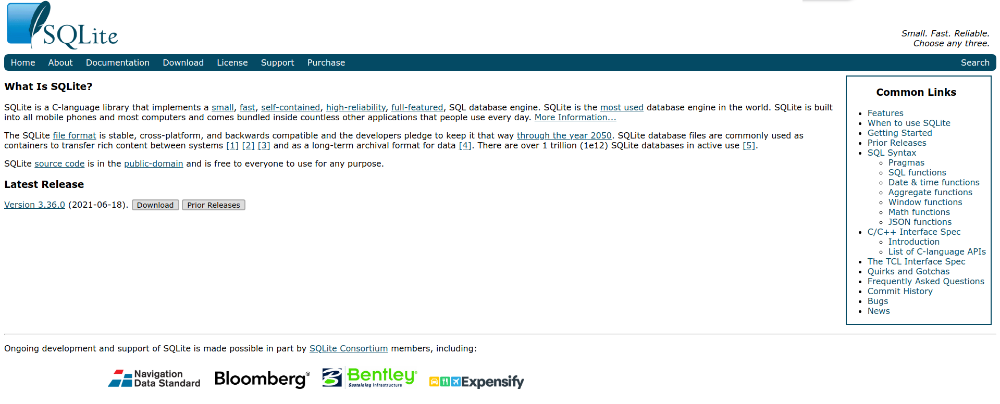
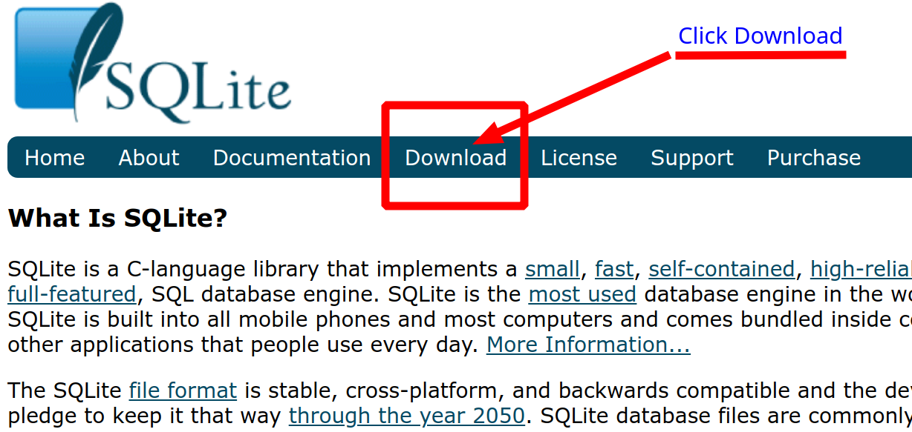
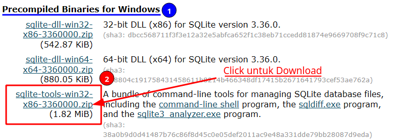
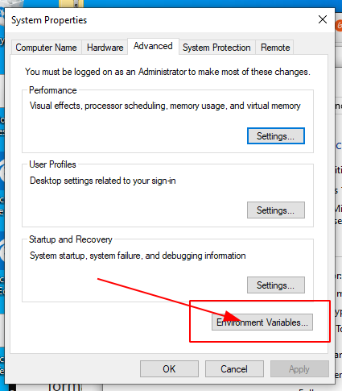
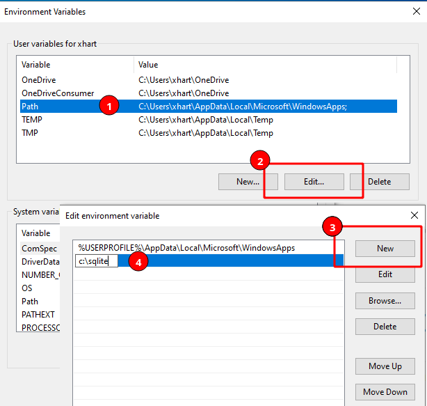
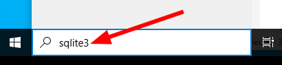
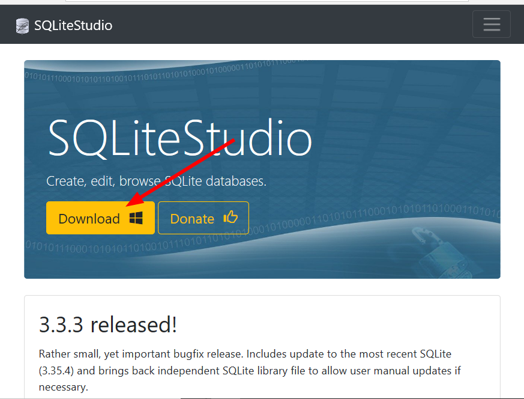
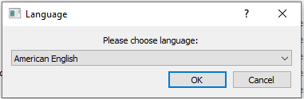
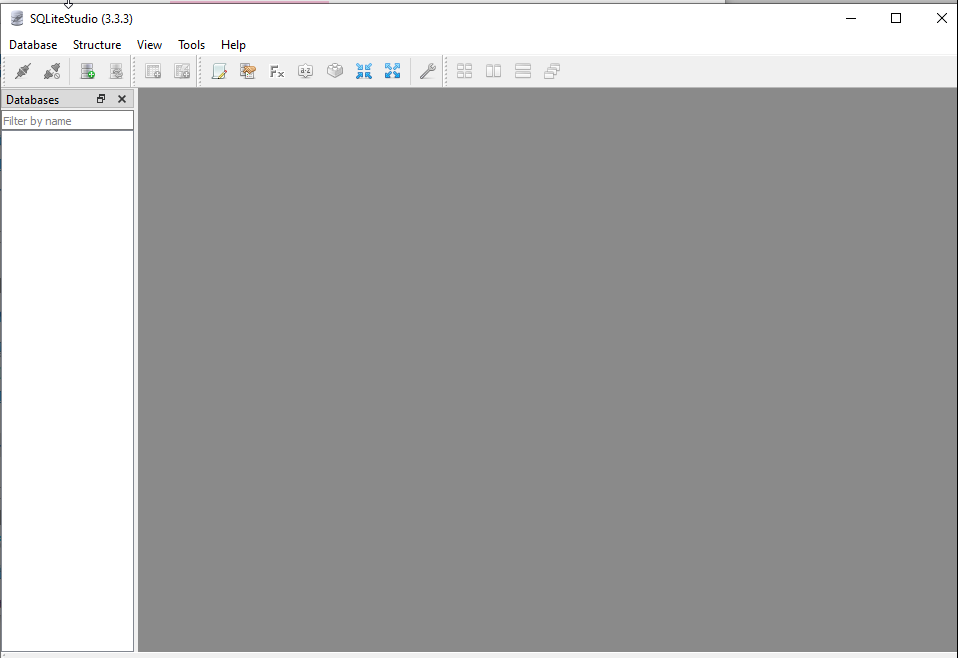

# Memasang SQLite pada OS Windows 10

## Obyektif:

- Setelah mengikuti tutorial ini, peserta akan dapat  menjalankan langkah demi langkah untuk  mengunduh, memasang dan menggunakan alat SQLite ke komputer atau laptop yang menggunakan operating system Windows.

## Persyaratan:

- Perangkat komputer atau laptop dengan Operating System Windows 10
- Mampu menggunakan operasi dasar pada Operating System Windows 10.

## Langkah

### 1. Unduh alat SQLite dari Website Offisial

- Akses ke : https://www.sqlite.org



- Arahkan mouse ke tautan Download, click mouse untuk memilih ragam pilihan download yang tersedia.



-  Dalam hal ini letakkan mouse pada judul "Precompiled Binaries for Windows" dan click "sqlite-tools-win32-x86...zip" untuk segera mengunduh alat SQLite, dan simpan pada lokasi direktori di komputer atau laptop Anda.



### 2. Pasang alat SQLite pada mesin komputer/laptop

- Buat Folder baru dengan nama "sqlite" dibawah direktori utama C:\

```powershell
c:\> mkdir c:\sqlite
```

- Extract hasil download pada langkah diatas, dan copy/move semua file hasil ekstrasi (ada 3 file: sqldiff.exe, sqlite3.exe dan sqlite3_analyzer.exe) ke folder c:\sqlite
- Tambahkan PATH c:\sqlite, melalui: Control Panel -> System and Security -> System -> Advanced System Settings -> Click Button "Environment Variables"



- Pada "Environment Variables", pilih (1) Path, (2) Click tombol Edit, (3) Click tombol New dan (4) Ketikkan "c:\sqlite"



- Click tombol OK, beberapa kali untuk keluar dari Control Panel

### 3. Uji coba hasil pemasangan alat SQLite3

- Melalui search bar, ketikkan sqlite3 dan enter.



- Tergantung pengaturan keamanan pada Operating System, perintah diatas akan mengaktifkan Windows Shell seperti ilustrasi dibawah ini:


- SQLite 3 cli (Command Line Interface), merupakan antar muka yang dapat digunakan untuk menjalankan perintah-perintah SQL pada SQLite3.
- Perintah sqlite3 cli (Command Line Interface), siap digunakan misal, ketikkan: .help (setiap perintah sqlite3 cli selalu dimulai dengan tanda titik (dot) ".").

```powershell
sqlite> .help
```

- Untuk keluar dari sqlite3 cli gunakan perintah:

```powershell
sqlite> .exit
c:\>
```

### 4. Mengunduh SQLite Studio

- Untuk memudahkan bekerja dengan SQLite, SQLite menyediakan "SQLite Studio", yang dapat dipasang dengan mengunduhnya dari: https://sqlitestudio.pl 

  

- Click tombol "Download" untuk memulai mengunduh, dan simpan pada folder.

### 5. Memasang SQLStudio

- Setelah proses unduh selesai, ekstrasi berkas hasil unduh ke folder yang diinginkan (misal c:\sqlstudio).
- Jalankan sqlstudio dengan men-*double-click* berkas SQLiteStudio.exe, hasil dari ekstrasi
- Pilih Language dengan "American English", dan click OK



- SQLite Studio sudah terpasang dan siap untuk digunakan

